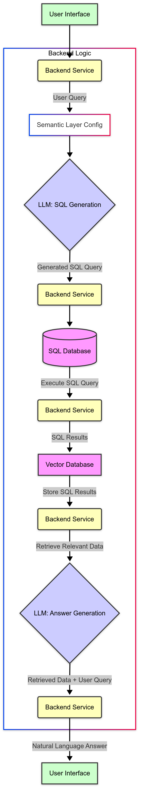

# Text-to-SQL RAG Chatbot

## Project Vision

To democratize data access within organizations by empowering non-technical users to intuitively query complex databases using natural language. Our chatbot serves as an intelligent bridge, translating human intent into precise SQL queries, retrieving relevant data, and presenting actionable insights in a clear, understandable manner.

## Project Description

This project implements a Text-to-SQL chatbot leveraging a Retrieval-Augmented Generation (RAG) architecture. It translates user queries in natural language into executable SQL commands, retrieves data from a relational database, and synthesizes the results back into a natural language answer.

A core component is the **Semantic Layer**, which provides a user-friendly abstraction over the technical database schema. This layer maps human-readable terms and concepts to their underlying technical representations, making the system intuitive and adaptable.

The backend is developed in Python, utilizing Large Language Models (LLMs) like Google Gemini for the translation and generation tasks. A vector database is used to enhance the RAG process. A separate frontend (planned using Angular) will provide the user interface.

## Key Features

*   **Natural Language Querying:** Users ask questions in plain English.
*   **Text-to-SQL Translation:** Converts natural language into accurate SQL queries.
*   **Retrieval-Augmented Generation (RAG):** Uses retrieved context (semantic layer, query results) to guide the LLM.
*   **Semantic Layer:** Maps user terms to database schema, configurable via JSON/YAML.
*   **Data Retrieval:** Executes generated SQL against the target database.
*   **Natural Language Answering:** Synthesizes SQL results into understandable human language.
*   **Modular Backend:** Designed with separate services for database interaction, LLM communication, and vector storage.
*   **Extensible Schema Mapping:** Semantic layer designed to be easily updated for different database structures.

## Architecture & Flow

The system follows a RAG pipeline:

1.  User enters a query in the UI.
2.  The Backend receives the query.
3.  The Backend loads/accesses the Semantic Layer configuration.
4.  The user query and the formatted Semantic Layer context are sent to the LLM (SQL Generation phase).
5.  The LLM generates an SQL query.
6.  The Backend executes the SQL query against the SQL Database.
7.  SQL results are retrieved.
8.  The SQL Results are stored (embedded) in the Vector Database.
9.  The original user query is used to retrieve relevant data from the Vector Database.
10. The retrieved data and the original user query are sent to the LLM (Answer Generation phase).
11. The LLM generates a natural language answer.
12. The Backend sends the answer back to the UI.



## Technologies Used
1. Backend: Python
2. Web Framework: FastAPI or Flask (Future - Currently a terminal application)
3. LLM: Google Gemini API (using requests for REST calls)
4. Vector Database: ChromaDB
5. SQL Database: SQLite (for demonstration)
6. Semantic Layer: JSON configuration files
7. Frontend: Angular (Planned)
8. Dependencies: google-generativeai (initially), chromadb, python-dotenv, requests

## Setup and Installation

1. **Clone the repository:**
```bash
git clone <repository_url>
cd text-to-sql-rag
```
2. **Create a virtual environment (Recommended):**
```bash
python -m venv .venv
source .venv/bin/activate  # On Windows use `.venv\Scripts\activate`
```
3. **Install dependencies:**
```bash
pip install -r requirements.txt
```
4. **Set up Environment Variables:**

Create a .env file in the root directory of the project and add your configuration.
```bash
GOOGLE_API_KEY="YOUR_GOOGLE_API_KEY"
DATABASE_PATH="data/mydatabase.db"
SEMANTIC_LAYER_PATH="data/semantic_layer.json"
CHROMA_DB_PATH="chroma_data"
```

5. **Set up the Dummy Database:**

Navigate to the utils directory and run the setup script. This creates the SQLite database and populates it with sample data based on the dummy semantic layer.
```bash
cd utils
python setup_database.py
cd .. # Go back to the root directory
```

## Configuration
- **.env:** Stores API keys and paths (as described above).
- **data/semantic_layer.json:** This file defines the semantic layer mapping. It includes technical names, human-readable names, descriptions, data types, and value mappings for tables and columns. Edit this file to adapt the chatbot to a different database schema. The structure follows a hierarchical database -> tables -> columns approach.

## Running the Application (Terminal Prototype)

Currently, the application runs as a terminal-based prototype.
- Ensure you have completed the setup steps above.
- Run the main script from the project root directory:
```bash
python main.py
```
The chatbot will initialize. Once ready, you can type your natural language queries in the terminal. Type quit or exit to close.

**Example Queries:**

Show me all orders.

What is the total amount of all sales?

List the names of all customers in California.

How many orders are there from New York?

Show me the order amounts for customer ID 1.

## Project Structure
```bash 
text-to-sql-rag/
├── .env                     # Environment variables (gitignore this!)
├── requirements.txt         # Python dependencies
├── main.py                  # Main terminal entry point (will become orchestrator for API)
├── config.py                # Configuration loader
├── data/
│   ├── semantic_layer.json  # Dummy semantic layer definition
│   └── mydatabase.db        # SQLite database file
├── database_service.py      # Handles SQL database interactions
├── llm_service.py           # Handles Gemini API calls (SQL gen, Embeddings, Answer gen)
├── semantic_layer.py        # Loads and formats the semantic layer config
├── vector_db_service.py     # Handles ChromaDB interactions
└── utils/
    └── setup_database.py    # Script to create/populate dummy database
```
## Milestones

The project development is planned in phases:
- Design and Implement Complete Backend Service: Architect and code all backend components (semantic layer loading, LLM services, DB service, Vector DB service) and integrate them into a functional API endpoint.
- Frontend Integration & Basic UI: Build the Angular frontend and connect it to the backend API for basic user interaction.
- Refinement & Robustness: Enhance error handling, logging, prompt engineering, and security.
- Semantic Layer Management Tooling: Develop scripts to assist in creating and managing the semantic layer configuration.
- Documentation & Deployment Preparation: Comprehensive documentation and preparing for deployment.

## Future Enhancements
- Implement robust SQL validation and sanitization to prevent injection attacks (essential for production).
- Refine LLM prompts and context retrieval strategy for improved accuracy and efficiency.
- Add support for more complex query types (joins, aggregations, filtering across multiple tables).
- Implement streaming responses for faster perceived performance.
- Develop the full Angular frontend with a user-friendly chat interface.
- Add caching mechanisms for frequently asked questions or data segments.
- Support connecting to different types of SQL databases (PostgreSQL, MySQL, etc.).
- Implement user authentication and authorization.

### Contributing

Contributions are welcome! Please open an issue or submit a pull request.